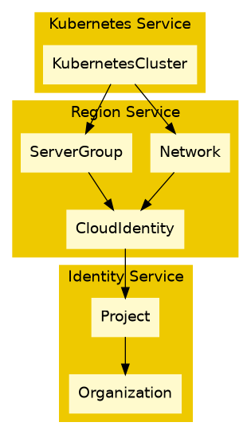

# Data Architecture

This document specifies the data architecture of all components in the system, their responsibilities and how they communicate.

## Changelog

- v1.0.0 2025-09-03 (@spjmurray): Initial RFC

## Motivation

The core problem we are trying to solve is as follows:

* Compute/Kubernetes V2 will allow networks to be provisioned by the user.
  * This allows multiple instances and clusters to coexist on the same L3 network.
  * It also allows sharing of fast file storage.
* Previously networks implicitly belonged to a single cluster, and would be cleaned
  up by cluster deletion.
* Now networks are a top level thing, with clusters hanging off them, and they need to respond to, and propagate, project deletion.

### Project Deletion

* The region service doesn't use traditional project namespaces to trigger deletion.
  * We need instead to listen for project deletion events and then trigger network deletion.
  * Network deletion must block until all users of it are deleted to prevent errors.
* We _should_ select a generic way to perform this across all components.
  * This means there are no surprises, everything works the same way.
  * We must consider a future where Kubernetes cannot scale further and we need to use better technologies.
  * We must consider a future without Kubernetes at all due to potential performance and operational overheads.

### Cascading Deletion

* Deleting a network should cascade delete clusters attached to it etc.
  * If we used the current model, we'd need a network namespace, nested in a project namespace, this exacerbates the problems outlined in the next section.
  * We need a mechanism where the network can be deleted, and clusters respond.

## Background

### Component Coupling

In early iterations of the platform, the Identity service defined a nested hierarchy of organizations and a single-depth project (i.e. projects cannot be nested themselves).
These were internally organized as custom resources that created namespaces: creating an organization created an organization namespace, creating a project would create a project within that organization namespace, then create its own project namespace.

This had a number of useful properties:

* Deleting an organization or project would delete its respective namespace, that would implicitly delete all resources contained within it.
* Organization or project deletion would block until its namespace was deleted, so we could be certain no resources were leaked.
* Organization or project namespace deletion could be blocked by managed resources (e.g. clusters), until their cleanup was complete.

Thus we had a stable platform where we would know if a deletion operation had hung, and could take action, and could be certain that cleanup had occurred and no resources were orphaned, wasting valuable resource that could be used by someone else.

It does however have some downsides:

* This system is tightly coupled to Kubernetes as a platform:
  * Due to the use of custom resources, this leads to `etcd` becoming a single point of failure.
    * it would be preferable to provide a choice of data store (i.e. a database), and even the option of outsourcing its operation entirely to a managed service.
  * For custom resources to be cleanly deleted via cascading deletion, components (both 1st and 3rd party), would need to be installed in the same Kubernetes cluster (or at least have access to it as a data store), putting all your eggs in one basket.
    * One example where avoiding this would be advantageous is a HA setup where the control plane lived across multiple sites.
    * Messages could be sharded across sites using message queue partitions, giving global, horizontal scaling.
    * You can use anycast routing, or some other (global server load balancing) to choose the closest server yielding improved head latency.
    * You can failover to different sites, by instructing a site to read messages from additional message queue partitions.
* Components are tightly coupled to the Identity service:
  * Components need to be aware of the organization/project hierarchy:
    * As an example, of the compute service needs to know about organizations and projects in order to follow the indirection of namespaces to ultimately find its own resources.
    * This is this highly inefficient in some situations.
      For list operations it _may_ be preferable to list all resources in a namespace, rather than do an indexed lookup via label selector.
      For create, read, update and delete operations it _should_ be a direct access by ID, rather than following all the indirection.
    * Moving resources between projects (changing ownership), requires a delicate orchestration of inhibiting updates on a resource to avoid spit brain, cloning it, then deleting the old version.
      This _should_ be a simple, atomic, task of just changing the project for example.
  * Components are required to know what the Identity service's data structures look like:
    * Modifications to those data structures will need to be mirrored in all services that consume them.

We need a system that addresses all of the pros and all of the cons at the same time, while fostering agility, security, performance etc.

While relevant to this discussion, there are some other considerations that need addressing, however for the sake of brevity, these are below in Appendix A.

## Architecture

### Data Model

Consider a Kubernetes cluster.
The Kubernetes cluster references a network and a server group (for control plane anti-affinity) in the region service.
The network and server group reference a cloud identity used to provision them (and used by Cluster API to directly create servers etc.)
The cloud identity references the project.

This can quite easily be described as a directed acyclic graph.

In the prior example, we could have added edges from networks to projects, but we are able to omit them as the relationship exists transitively via the cloud identity etc.
This minimizes network traffic and general complexity.

#### Cascading Deletion Propagation

When the project is marked as in deletion it must raise a deletion event.

The region service witnesses this event and cascade deletes the cloud identity, as this relationship sits at a data boundary.
The cloud identity cascade deletes its network and server group.

The Kubernetes cluster then witnesses the deletion of the network and server group it references and triggers its deletion.

#### Deletion Cleanup

The only thing without a parent reference is the Kubernetes cluster, so it proceeds with deletion.
That cleans up any implicitly created servers, load balancers etc.
Critically, as the cloud identity is blocked from deletion, OpenStack isn't just going to orphan those resources.
Once complete, it removes references to network and server group.

The region controller can now clean up the server group and network.
Those resources remove references from the cloud identity and can be deleted.

The deletion of the cloud identity removes the final reference to the project and that can be cleaned up.

### Data Handling

We have already touched on this in the background section: components rely on intimate knowledge of the internal workings of the identity service in order to operate.

* It's hard to modify the identity service without affecting every other component down the dependency tree.

#### Data Boundaries

The goal here is to draw a box around any service:

* A service exclusively owns anything to do with things it manages.
* Components that need to access those resources must do so via a versioned API.
  * This means the storage format of the data can change independently of the API.
  * Because it's an API, there is no reason for a component to be co-located with any other service, bringing with it the possibility of geographic/geopolitical isolation
* A service can have its own storage, meaning it can choose its own implementation
* A service and can scale independently of another component.

#### Data Storage

Data storage is currently entirely based on Kubernetes CRDs, however this specification does not limit you to that.
You can use any data storage solution you desire whether for consistency, security, scalability or performance reasons.

Keep in mind the chosen medium must support:

* Tombstones.
  * Record that some actor has requested deletion to be processed asynchronously.
* Deletion ordering semantics.
  * Record references to indicate its still in use.

Data storage must be isolated to only the component that manages it, so that it can be independently replaced, modified etc. without affecting another.

Data storage must support optimistic locking to support conflict detection e.g. a resource has been modified between a read and write.
This ensures updates are never lost.

### Messaging

One service's resources may implicitly depend on those managed by another service.

For example the Compute service needs to be aware of projects.
If a project is deleted, it must take action to perform any clean up and return resources to the pool for use (and purchase) by another user.

Every resource in the system will have at least one parent (with the exception of organizations) e.g. a compute cluster belongs to a project.
We will use a push based model, influenced by message queue, where resource events are published and can be subscribed to by interested parties.

Initially this is based on Kubernetes' list/watch, but is designed in a way where it can be replaced with a more scalable, enterprise offering e.g. Confluent.

The behavior is described below:

* On service start/restart all existing resources on the subscribed topic must be replayed.
  * This allows clients to trigger deletion if missed previously.
  * All subsequent events must be streamed to minimize network bandwidth.
* The only data that should be relayed by the message queue is very thin event e.g. resource ID that can be used to lookup current resource state via an API, and other routing and filtering information.
  * Event payload is described in more detail below.
* Events must be delivered at least once, and subscribers must handle these idempotently.

The payload will be a JSON object containing:

* `resourceID`: the Id is the resource, the type is inferred from the subscribed topic.
* `deletionTimestamp`: optional, if set this can be used to filter the stream.

### Deletion

#### Deletion State Machine

Deletion is processed as a state machine:

* `DELETING`: A resource is first turned into a tombstone, with an attached deletion timestamp.
   * This will raise a deletion event, with the `deletionTimestamp` set.
   * A resource will wait for any preconditions to be fulfilled (see ordering below).
   * Children cannot be registered with this resource.
* `DRAINING`: A resource will then clean the resources it owns and wait for their explicit removal.
* `FINALIZING`: A resource will then release any references it has on other resources (see ordering below).
* `DELETED`: The resource is finally deleted entirely.
  * Before being deleted, an event will be raised to delete the resource from any message queues.
  * The resource can then be garbage collected.

#### Cascading Deletion

Taking the region service as an example, it will listen for project deletion in order to perform identity cleanup.
All it needs to do is witness the project deletion event, then query all leaf resources directly referencing that project that are managed by that service (maintaining data boundaries), then trigger a deletion of those resources.

#### Ordering

Picking on OpenStack a prime example of how not to do it.
If for example you deleted a network, chances are it will return an error as there are some ports, servers etc. still using it, then you need to track down what resources those are, and delete them, and invariably, they will error as they have some sub resources...
So we really want to avoid this as it's a terrible UX, and instead just do the right thing and allow cascading deletion.

The problem gets worse with OpenStack's identity service, which will quite happily delete a project, but it makes no attempt to do cascading deletion of networks, servers etc. and these all get orphaned.

This specification exists to right those wrongs, but do it in a nice, scalable way.

We use the concept of references to control ordering of deletion.
This is just a fancy parent/child version of reference counting.

The rules are simple:

* A parent resource can indicate it's using a child resource by applying a reference.
  * A compute cluster can indicate it's using a project, a server can indicate it's using a network, etc.
  * References may cross data boundaries, and thus must be set using APIs.
  * As references are managed from a reconcile loop, these APIs must be idempotent.
  * When references are added, they must only be done so before the resource is used.
  * When references are removed, they must only be dome so after the resource is no longer used.
* When a resource is marked for deletion, no action is taken if any references exist on that resource: it blocks in the `DELETING` state.
  * Only once all references are removed can the deletion proceed, transitioning to the `DRAINING` state.
  * After any child resources are cleaned up, the resource must remove any references it has applied to other resources in the `FINIALIZING` state.
  * Finally it can be erased from existence in the `DELETED` state.

Another useful feature of resources is that a UX component can poll the used resource for references and determine what other resources would be directly deleted if it were, without having to know about different services and how to derive who used what.

How this is implemented is up to the service that implements it:

* Kubernetes finalizers (inter-service).
  * These _must_ be used, rather than a field in the resource specification as the resource spec becomes immutable on deletion.
* Kubernetes owner references and blocking deletes (intra-service, within the same namespace).

The top level reference API will look similar to:

**PUT /api/v1/resource/references/{reference}** 

which idempotently creates the named reference on the resource, returning HTTP 200 on success and:

**DELETE /api/v1/resource/references/{reference}**

which idempotently removes the named reference on the resource, returning HTTP 200 on success.

The reference must conform to the Kubernetes finalizer standard, and uniquely identify a specific resource within the system e.g `cluster.compute.organization.tld/7f7a15ab-f1cc-4f3b-b1c0-232ae8d852ce`.

References do not lapse; operators must be notified of a deadlock and they must manually diagnose and fix the issue.

## Appendix A - Further Reading aka The Bigger Picture

While not strictly part of this specification, these are some "bigger picture" items to take into consideration.

### Kubernetes as a Database

If we treat Kubernetes resources as a database tables, then in the above example, the Compute service would need to read the Identity service's organization table, to discover the organization's project table, to then discover it's own cluster resources.
What would be a lot better is if we modeled this as just a big table of clusters.
This would be analogous to having them all contained in a single namespace.

To ease pressure on the Kubernetes API, those organization and project tables are cached.
Thus _every_ service that needs to be aware of the organizational hierarchy needs to have a full copy of all of those tables.
This leads to unnecessary memory utilization.
It's also fragile in sense that as the platform grows, we may encounter out-of-memory situations as these caches grow (and we have), and that requires the a redeployment with bigger limits.
What would be more robust is to separate concerns, make it a database's problem.

Finally from a security standpoint, services unnecessarily need access to read all organizations and projects, which may lead to leaking of information, or worse still a misconfiguration may lead to a service being able to modify something it shouldn't.

### Testing, Tooling and Support

The whole organizational hierarchy awareness makes testing orders of magnitude harder than it need be.
To write tests for your service you need to craft organizations and their namespaces, projects and their namespaces nested within those organizations, before finally being able to create cluster resources in those project namespace.

As in the Kubernetes as a database aside, by treating clusters as a big table, we don't need to worry about organizational hierarchies and can just create our test resources and get on with it.

Very similar to testing, following a load of indirection causes unnecessary complexity.
By striving to remove this, writing tooling becomes an order of magnitude easier.

Tooling is just an automated version of manual support.
In a crisis situation, added complexity means more mistakes can happen exacerbating problems.

### Access Control

Do we really care about organizations and projects at the individual service level?
Probably not, they are just nodes in a graph, and they can have a parent.
This opens up possibilities of having arbitrary organization hierarchies e.g. nested projects.

ReBAC/ABAC should be abstracted away so you ask the Identity service, "given this resource with these parent attributes, can I create/read/update/delete it?"
List operations are just bulk reads, but with query parameters to limit the scope, and that query can be delegated to the Identity service to work out what needs to be performed in the local service without knowledge of hierarchies.

