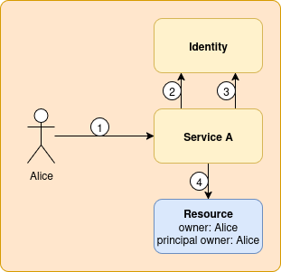
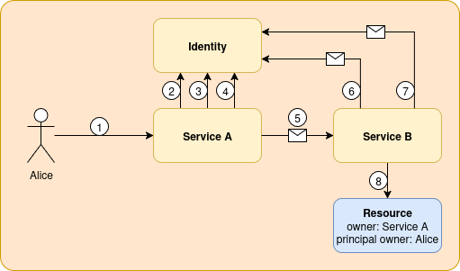

# Identity Authentication Modes of Operation

## Changelog

- v1.0.0 2025-07-10 (@spjmurray): Initial Draft

## API Design

All APIs are defined as OpenAPI schemas, this brings the benefits of automatic generation of servers, clients, types and documentation.

All protected API endpoints are authenticated with oauth2, specifically OIDC which brings with it access token introspection thus allowing for resources to be augmented with audit information e.g. who created it, who last modified it, along with server audit logs to provide a timeline of changes.

## Modes of Operation

There are a number of authentication strategies that are employed, this documents them.

### End User to Service

Consider the following diagram:

1. The user is in possession of an access token (acquired through the standard oauth2 authorization code flow).
   The user forwards this token to an API endpoint of Service A.
2. Access tokens are opaque, in this situation they are JWE encrypted, so the only entity that can decrypt them is the Identity service.
   Service A first forwards the access token to the OIDC user info endpoint, which decrypts and validates the token, then returns user information for use with audit logging.
3. Service A also forwards the token to the ACL endpoint to get a set of operations, scoped to organizations and projects that the user has permission to perform.
4. The API endpoint handler is then responsible for enforcing RBAC, if this succeeds then a resource can be created.

### Service to Service

This situation is similar to the End User to Service use case, but in this instance Service A acts on behalf of the end user and provisions resources in Service B.

Consider the following diagram:

Steps 1-3 are as defined in the earlier example.

4. Service A will act on behalf of the end user, but as all APIs are guarded by oauth2, it needs an access token.
   Service A can do one of two things here, it can call into the Identity service to issue a short lived access token using the client credentials grant (the client is identified via mTLS, and the CN is used to map to a role), that role will typically contain global permissions so it can create resources in any organization and project.
   The key thing to note is that an end user will be able to see and perform operations on those resources if they have permission, and may interfere with managed services.
   The other option is to use a pre-existing service account which ties Service A to a specific organization.
   The key difference here is that an end-user will not be able to see or interact with any of those resources.
5. Service A forwards its access token on to Service B when calling an endpoint.
   It always does this via mTLS, because a short lived access token will be bound to client certificate.
   Additionally we can use mTLS to provide integrity checks on principal information (covered in a separate specification).
6. Service B forwards the access token to the Identity service user info endpoint much like in the End User to Service flow.
   In this instance mTLS has proved that the client certificate is valid by performing proof of possession of the accompanying private key.
   The client certificate is also forwarded to identity service so it can validate a X.509 bound token.
7. Service B forwards the access token and client certificate to the ACL endpoint as before.
8. The API endpoint handler operates as before.

## The Future...

### Service to Service Trust Issues

You can actually cause some potential problems by exflitrating a short lived access token and a public certificate.
If you noticed, we can forward both of these to the Identity service, and possibly be granted privilege to do something.
Proof of possession of a private key is only possible at the relaying service.
As it stands, no core service has any permissions to do anything with the Identity service, so not a major concern.

As a very rudimentary hardening, Identity should only accept X.509 bound access tokens if that is over a verified mTLS connection.

### Removing Access Tokens for Service to Service

RBAC currently requires an access token to operate, mostly for simplicity as you only have one primitive to worry about.
We could modify the authentication mechanism so that issuing a short lived access token is not necessary, and instead a service running mTLS can directly call the ACL endpoint, presenting the initiator's certificate.

The RBAC code would allow a presented access token to take precedence, to support that use case where a service wants to use a service account.
As a fallback, if a client certificate is available, then the CN can be mapped directly to a role.
To handle auditing, the CN can be read directly from the certificate.

### SPIFFE

Another idea that has been floated is the use of SPIFFE, were X.509 certificates are issued transparently by an agent.
This would be a natural follow on removing the need for access tokens over mTLS.
This could lead to:

* Reduced in-tree configuration for client PKI
* Less client code to manage mTLS

But at the expense of having to install and manage yet another service and provide configuration for workload attestation.

RBAC could be as simple as forwarding Service A's SVID to the identity service that will translate the SPIFFE ID into an ACL.
We absolutely must not forward just the SPIFFE ID, as that would allow impersonation and potential privilege escalation.
